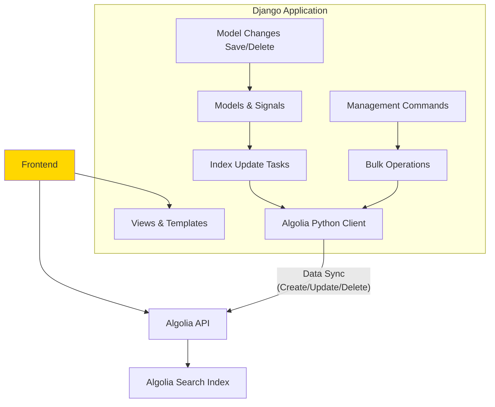

# BookHub - Lightning Fast Search with Django & Algolia

A modern book catalogue application demonstrating how to integrate Algolia search with Django for lightning-fast, typo-tolerant search functionality.

## 🚀 Features

- **Lightning Fast Search**: Powered by Algolia's managed search service
- **Typo Tolerance**: Find books even with spelling mistakes
- **Real-time Search**: InstantSearch.js provides instant results as you type
- **Advanced Filtering**: Filter by genre, author, and publication year
- **Modern UI**: Beautiful, responsive design with Tailwind CSS
- **Admin Integration**: Algolia-powered search in Django admin
- **Auto-indexing**: Automatic synchronization with Algolia when data changes

## 🛠️ Tech Stack

- **Backend**: Django 5.2+
- **Search**: Algolia + algoliasearch-django
- **Frontend**: Tailwind CSS + InstantSearch.js
- **Database**: SQLite (development)

## Architecture



## 📋 Prerequisites

- Python 3.8+
- Algolia account (free tier available)

## 🔧 Installation

1. **Clone the repository**
   ```bash
   git clone <repository-url>
   cd bookhub
   ```

2. **Create virtual environment**
   ```bash
   python -m venv .venv
   source .venv/bin/activate  # On Windows: .venv\Scripts\activate
   ```

3. **Install dependencies**
   ```bash
   pip install django algoliasearch-django python-dotenv algoliasearch
   ```

4. **Set up environment variables**
   ```bash
   cp env.template .env
   ```
   
   Edit `.env` and add your Algolia credentials:
   ```
   ALGOLIA_APP_ID=your_app_id_here
   ALGOLIA_ADMIN_KEY=your_admin_key_here
   ALGOLIA_SEARCH_KEY=your_search_key_here
   ```

5. **Run migrations**
   ```bash
   python manage.py migrate
   ```

6. **Create superuser**
   ```bash
   python manage.py createsuperuser
   ```

7. **Load sample data**
   ```bash
   python manage.py load_sample_books --count 50
   ```

8. **Index data to Algolia** (if you have valid credentials)
   ```bash
   python manage.py algolia_reindex
   ```

9. **Run the development server**
   ```bash
   python manage.py runserver
   ```

## 🎯 Usage

### Web Interface

- **Homepage**: Browse all books at `http://localhost:8000/`
- **Search**: Advanced search at `http://localhost:8000/search/`
- **Admin**: Django admin at `http://localhost:8000/admin/`

### Search Features

- **Text Search**: Search across titles, authors, and descriptions
- **Filters**: Filter by genre, author, and publication year
- **Typo Tolerance**: "harri potter" will find "Harry Potter"
- **Highlighting**: Search terms are highlighted in results
- **Pagination**: Navigate through large result sets

### Admin Features

- **Algolia-powered search**: Admin search uses Algolia for better relevance
- **Bulk operations**: Add, edit, and delete books with automatic indexing

## 🏗️ Project Structure

```
bookhub/
├── bookhub/                 # Django project settings
│   ├── settings.py         # Main settings with Algolia config
│   └── urls.py             # URL routing
├── catalogue/              # Main app
│   ├── models.py           # Book model
│   ├── index.py            # Algolia index configuration
│   ├── admin.py            # Admin with Algolia search
│   ├── views.py            # Views for book listing and search
│   └── management/         # Management commands
│       └── commands/
│           └── load_sample_books.py
├── templates/              # HTML templates
│   ├── base.html           # Base template
│   └── catalogue/
│       ├── book_list.html  # Book listing
│       ├── book_detail.html # Book details
│       └── search.html     # Search page with InstantSearch.js
└── static/                 # Static files (CSS, JS)
```

## ⚙️ Configuration

### Algolia Settings

The Algolia configuration in `settings.py`:

```python
ALGOLIA = {
    "APPLICATION_ID": os.getenv("ALGOLIA_APP_ID", "dummy_app_id"),
    "API_KEY": os.getenv("ALGOLIA_ADMIN_KEY", "dummy_admin_key"),
    "SEARCH_KEY": os.getenv("ALGOLIA_SEARCH_KEY", "dummy_search_key"),
    "AUTO_INDEX": False,  # Set to True for automatic indexing
}
```

### Index Configuration

The `BookIndex` class in `catalogue/index.py` defines:

- **Searchable attributes**: title, author, description
- **Facetable attributes**: genre, author, published_year
- **Custom ranking**: Newer books ranked higher
- **Search settings**: Typo tolerance, plurals, stop words

## 🔍 Search Implementation

### Backend Search (Admin)

The admin uses `raw_search()` to query Algolia and preserve result ordering:

```python
def get_search_results(self, request, queryset, search_term):
    if not search_term:
        return super().get_search_results(request, queryset, search_term)
    
    response = raw_search(Book, search_term)
    object_ids = [hit['objectID'] for hit in response['hits']]
    # ... preserve Algolia ordering
```

### Frontend Search (InstantSearch.js)

The search page uses InstantSearch.js widgets:

- **searchBox**: Main search input
- **hits**: Search results with highlighting
- **refinementList**: Filters for genre, author, year
- **stats**: Result count and timing
- **pagination**: Navigate results

## 📊 Performance

With Algolia, you can expect:

- **Sub-50ms search latency** (p95)
- **Typo tolerance** out of the box
- **Synonym support** for better matching
- **Faceted search** for filtering
- **Highlighting** of search terms

## 🚀 Deployment

### Environment Variables

For production, set these environment variables:

```bash
ALGOLIA_APP_ID=your_production_app_id
ALGOLIA_ADMIN_KEY=your_production_admin_key
ALGOLIA_SEARCH_KEY=your_production_search_key
DEBUG=False
SECRET_KEY=your_secret_key
```

### Indexing Strategy

- **Development**: Manual indexing with `algolia_reindex`
- **Production**: Enable `AUTO_INDEX=True` for real-time updates
- **Bulk updates**: Use management commands for large data imports

## 🤝 Contributing

1. Fork the repository
2. Create a feature branch
3. Make your changes
4. Add tests if applicable
5. Submit a pull request

## 📝 License

This project is licensed under the MIT License.

## 🔗 Resources

- [Algolia Documentation](https://www.algolia.com/doc/)
- [algoliasearch-django](https://github.com/algolia/algoliasearch-django)
- [InstantSearch.js](https://www.algolia.com/doc/guides/building-search-ui/what-is-instantsearch/js/)
- [Django Documentation](https://docs.djangoproject.com/)

## 🆘 Troubleshooting

### Common Issues

1. **"Name or service not known" error**: Check your Algolia credentials
2. **Search not working**: Ensure data is indexed with `algolia_reindex`
3. **Admin search failing**: Verify `raw_search` import and error handling
4. **InstantSearch.js not loading**: Check CDN links and API keys

### Getting Help

- Check the [Algolia Community](https://discourse.algolia.com/)
- Review [Django documentation](https://docs.djangoproject.com/)
- Open an issue in this repository 
